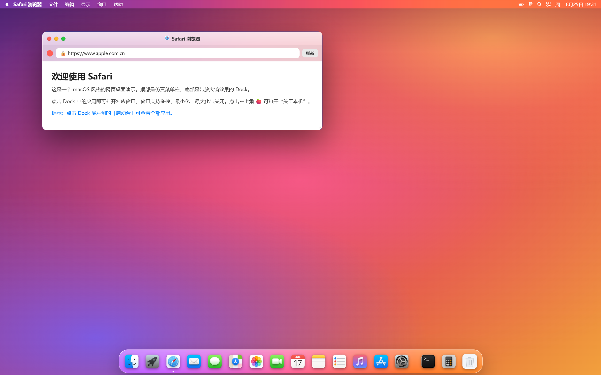

[English](README.md) | [简体中文](README_Simplified_Chinese.md) | [繁體中文](README_Classical_Chinese.md)

此乃**仿真 macOS Sonoma 之網頁桌面模擬器**也，純以原生 HTML、CSS、JavaScript 構成，不假外物框架。今試從技術、交互、功能三端，為君詳述之。

### 一、架構與技藝
*   **純前端單頁之製**：眾碼咸集於 `index.html` 一檔，藉 CSS 變數（`var`）統御主題（選單之高、圓角、字體）。
*   **毛玻璃之效（Glassmorphism）**：多施 `backdrop-filter: blur()` 與 `saturate()`，令選單、Dock、窗牖皆呈半透磨砂之質，宛然 macOS 之層次。
*   **資源容錯之機**：圖標之屬，先試取 `assets/icons/<key>.png` 真影；若失利，則無縫回退於內嵌之高精 SVG 矢量，故視效常存不墜。
*   **壁紙自適**：初以 CSS 繪 Sonoma 漸變之壁，復自察 `assets/wallpaper.jpg` 而代易之。

### 二、交互與窗牖之制（幾近原生）
*   **窗牖之系**：
    *   可**拖曳以移**（執其標題），可**隅陬邊緣以伸縮**（凡八方），可**最小化**（縮影沈於底），可**最大化**（彌滿選單與 Dock 之間）。
    *   點窗則自**聚焦居前**（`z-index` 隨而升），邊影益明。
*   **Dock 之塢**：
    *   **懸停放大之效（Magnification）**：度鼠與圖標中心之距，以算其倍（至二點零倍），過渡舒徐。
    *   **智隱之制**：鼠離下緣，Dock 自沈而隱；及至下緣或臨其上，則立現，全仿 macOS 之行。
    *   運行中諸應用，圖標下現小墨點以識之。
*   **全域選單之欄**：左上真應點擊，展 **Apple 選單**（含關於本機、睡眠、重啟之擬項），右列實時之鐘、Wi-Fi、電池諸識。

### 三、預置諸應用之析（非徒虛設）
內嵌原生風之應用十有五，其中數者有**實交互之機**：

| 應用 | 機能 |
| :--- | :--- |
| **算器** | 通運無礙，備加減乘除以及正負、百分，其理嚴整（兼連續之算）。 |
| **終端** | 擬 Bash 之境，通 `help`、`date`、`whoami`、`echo`、`clear`、`neofetch`、`ls` 諸令，輸出有彩。 |
| **隨筆** | 左列可點而易之，右域之文隨而變，亦許手書更竄。 |
| **系統之設** | 備暗模式、Wi-Fi、藍牙諸**開關**，且有「自隱 Dock」之實控（與主界面相應）。 |
| **啟動台** | 全屏毛玻璃之境，以格陳諸應用，點之即啟。 |
| **訪達 / Safari / 照片** | 佈局精雅之靜態虛設，以陳 Finder 側欄、Safari 地址之欄、照片流之格。 |

### 四、細節與體驗之琢
*   **開機之動**：頁啟，現玄屏而轉環其中，歷一秒而淡去，若系統初醒。
*   **右擊之單**：空處右擊，出上下文之單，可速啟啟動台、關於本機，或易 Dock 之隱。
*   **交通之燈**：窗牖左上紅（閉）、黃（最小化）、綠（最大化）三鈕，懸則現其符（×、−、＋），微交互畢肖。

### 五、結語
此非徒易皮之面，乃**輕而完之桌面系統前端框架**也。盡用今之 CSS 與瀏覽器事件之模，於常網之中，竟成**多窗之制、空間之交互（伸縮拖曳吸附）與局部應用之機**。無論資於技術之學、個人作品之陳，抑或為網應容器（Shell）之範，皆極其完備而工雅。君可直啟於瀏覽器，得近真 macOS 之趣。

## 版權

[MIT](LICENSE)
